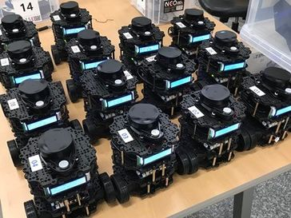

# Rising Turtle

Hacked version of TurtleBot3



**Table of Contents**
1. [스펙](#스펙)
2. [OpenCR 설치](#opencr-설치)
   1. [(1) IDE 설치](#1-ide-설치)
   2. [(2) Arduino 라이브러리 추가(반드시 위의 과정들이 선행되어야 함)](#2-arduino-라이브러리-추가반드시-위의-과정들이-선행되어야-함)
   3. [(3) OpenCR에 RISE_TurtleBot3 업로드](#3-opencr에-rise_turtlebot3-업로드)
3. [라즈베리파이 이미지 설치](#라즈베리파이-이미지-설치)
4. [기타](#기타)
   1. [기능 변경을 위해 알아햐 하는 것](#기능-변경을-위해-알아햐-하는-것)
   2. [Remote Access with GUI](#remote-access-with-gui)
5. [License](#license)

## 스펙

아래 값은 OpenCR code의 일부이다.

```
#ifndef TURTLEBOT3_BURGER_H_
#define TURTLEBOT3_BURGER_H_

#define NAME                             "Burger"

#define WHEEL_RADIUS                     0.033           // meter
#define WHEEL_SEPARATION                 0.160           // meter (BURGER : 0.160, WAFFLE : 0.287)
#define TURNING_RADIUS                   0.080           // meter (BURGER : 0.080, WAFFLE : 0.1435)
#define ROBOT_RADIUS                     0.105           // meter (BURGER : 0.105, WAFFLE : 0.220)
#define ENCODER_MIN                      -2147483648     // raw
#define ENCODER_MAX                      2147483648      // raw

#define MAX_LINEAR_VELOCITY              0.22   // m/s   (BURGER : 0.22, WAFFLE : 0.25)
#define MAX_ANGULAR_VELOCITY             2.84   // rad/s (BURGER : 2.84, WAFFLE : 1.82)

#define MIN_LINEAR_VELOCITY              -MAX_LINEAR_VELOCITY  
#define MIN_ANGULAR_VELOCITY             -MAX_ANGULAR_VELOCITY 

#endif  //TURTLEBOT3_BURGER_H_
```

## OpenCR 설치

### (1) IDE 설치

OpenCR에 코드를 올리기 위해 몇가지 과정을 진행한다. 이 과정은 [로보티즈 공식 가이드(OpenCR for Windows)](http://emanual.robotis.com/docs/en/parts/controller/opencr10/#install-on-windows)에서 내용을 가져왔으며 Windows 10을 가정한다. Windows 10이 아니라면 위 링크에서 안내하는 방법을 따른다.

1. Arduino IDE 설치
2. IDE를 열고, `File → Preferences`에서 `Additional Boards Manager URLs`에 아래 주소를 입력하고 `OK`를 누른다.
   ```
   https://raw.githubusercontent.com/ROBOTIS-GIT/OpenCR/master/arduino/opencr_release/package_opencr_index.json
   ```
3. Boards Manager를 통한 OpenCR package 설치
   1. `Tools → Board → Boards Manager...`에서 검색창에 `OpenCR`을 검색한다.
   2. ROBOTIS에서 만든 최신 버전을 설치한다. 이 과정은 몇 분 정도 걸립니다.
   3. 설치가 정상적으로 되었다면, 이제 `Tools → Board`에서 `OpenCR`을 선택할 수 있다.
   4. `Tools → Board`에서 `OpenCR → OpenCR Board`를 선택한다.

### (2) Arduino 라이브러리 추가(반드시 위의 과정들이 선행되어야 함)

1. 아두이노 라이브러리 위치에 본 저장소의 `rise-opencr` 폴더 자체를 복사하여 붙여넣습니다.
   - 라이브러리 위치는 컴퓨터마다 다릅니다. 다음 경로들은 참고용입니다.
   - 경우1: ~\Documents\ArduinoData\packages\OpenCR\hardware\OpenCR\1.3.1\libraries
   - 경우2: C:\Users\유저이름\AppData\Local\Arduino15\packages\OpenCR\hardware\OpenCR\1.3.1\libraries
2. 이제 `File → Examples`에서 `RISE_TurtleBot3`를 볼 수 있습니다.

### (3) OpenCR에 RISE_TurtleBot3 업로드

1. `File → Examples → RISE_TurtleBot3`에서 `rise_core`를 엽니다.
2. Verify(`✓`모양 버튼)를 눌러 코드에 이상이 없는지 확인합니다.
3. Upload(`→`모양 버튼)을 눌러 OpenCR에 해당 코드를 업로드합니다. 

## 라즈베리파이 이미지 설치

Install skku_ros_turtlebot image with Win32DiskImager.

## 기타

### 기능 변경을 위해 알아햐 하는 것

* [ROS Kinetic](http://wiki.ros.org/kinetic)
* [Turtlebot3 Docs](http://emanual.robotis.com/docs/en/platform/turtlebot3/overview/)
* Dynamixel XL430-W250-T 

특히 터틀봇 소스코드와 다이나믹셀 SDK 사용법에 대해 잘 파악해야 한다.

### Remote Access with GUI

Install `xrdp` in raspberry pi

## License

- 로보티즈에서 제공하는 터틀봇3의 모든 코드는 [아파치 2.0 라이센스](https://github.com/ROBOTIS-GIT/turtlebot3/blob/master/LICENSE)입니다. 따라서 본 저장소의 `opencr` 코드는 터틀봇3 버거의 OpenCR 코드를 수정한 것임을 밝힙니다.

