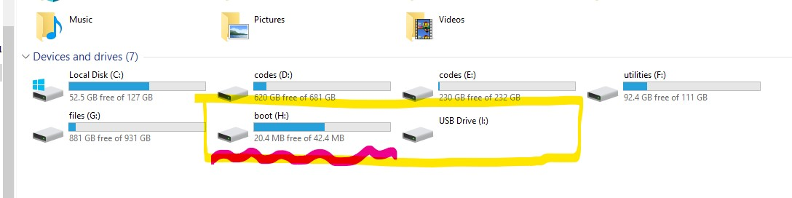

# Rising Turtle

Hacked version of TurtleBot3


**Table of Contents**
1. [Hardware Specifications](#hardware-specifications)
2. [복구 방법](#복구-방법)
   1. [(1) OpenCR 복구](#1-opencr-복구)
   2. [(2) 라즈베리파이 복구](#2-라즈베리파이-복구)
3. [백업 방법](#백업-방법)
   1. [(1) OpenCR 백업](#1-opencr-백업)
   2. [(2) 라즈베리파이 백업](#2-라즈베리파이-백업)
4. [기타](#기타)
   1. [기능 변경을 위해 알아햐 하는 것](#기능-변경을-위해-알아햐-하는-것)
   2. [Remote Access with GUI](#remote-access-with-gui)
5. [Licenses](#licenses)

## Hardware Specifications

아래 값은 OpenCR code의 일부이다.

```
#ifndef TURTLEBOT3_BURGER_H_
#define TURTLEBOT3_BURGER_H_

#define NAME                             "Burger"

#define WHEEL_RADIUS                     0.033           // meter
#define WHEEL_SEPARATION                 0.160           // meter (BURGER : 0.160, WAFFLE : 0.287)
#define TURNING_RADIUS                   0.080           // meter (BURGER : 0.080, WAFFLE : 0.1435)
#define ROBOT_RADIUS                     0.105           // meter (BURGER : 0.105, WAFFLE : 0.220)
#define ENCODER_MIN                      -2147483648     // raw
#define ENCODER_MAX                      2147483648      // raw

#define MAX_LINEAR_VELOCITY              0.22   // m/s   (BURGER : 0.22, WAFFLE : 0.25)
#define MAX_ANGULAR_VELOCITY             2.84   // rad/s (BURGER : 2.84, WAFFLE : 1.82)

#define MIN_LINEAR_VELOCITY              -MAX_LINEAR_VELOCITY  
#define MIN_ANGULAR_VELOCITY             -MAX_ANGULAR_VELOCITY 

#endif  //TURTLEBOT3_BURGER_H_
```

## 복구 방법

### (1) OpenCR 복구

#### Step 1. IDE 설치

OpenCR에 코드를 올리기 위해 몇가지 과정을 진행한다. 이 과정은 [로보티즈 공식 가이드(OpenCR for Windows)](http://emanual.robotis.com/docs/en/parts/controller/opencr10/#install-on-windows)에서 내용을 가져왔으며 Windows 10을 가정한다. Windows 10이 아니라면 위 링크에서 안내하는 방법을 따른다.

1. Arduino IDE 설치
2. IDE를 열고, `File → Preferences`에서 `Additional Boards Manager URLs`에 아래 주소를 입력하고 `OK`를 누른다.

   ```url
   https://raw.githubusercontent.com/ROBOTIS-GIT/OpenCR/master/arduino/opencr_release/package_opencr_index.json
   ```

3. Boards Manager를 통한 OpenCR package 설치
   1. `Tools → Board → Boards Manager...`에서 검색창에 `OpenCR`을 검색한다.
   2. ROBOTIS에서 만든 최신 버전을 설치한다. 이 과정은 몇 분 정도 걸린다.
   3. 설치가 정상적으로 되었다면, 이제 `Tools → Board`에서 `OpenCR`을 선택할 수 있다.
   4. `Tools → Board`에서 `OpenCR → OpenCR Board`를 선택한다.

#### Step 2. Arduino 라이브러리 추가(반드시 위의 과정들이 선행되어야 함)

1. 아두이노 패키지 위치에서 OpenCR Libraries 위치에 본 저장소의 `rise-opencr` 폴더 자체를 복사하여 붙여넣는다.
   - 라이브러리 위치는 컴퓨터마다 다르다. 다음 경로들은 참고용이다.(1.3.1은 OpenCR 버전이다.)
   - 경우1: `~\Documents\ArduinoData\packages\OpenCR\hardware\OpenCR\1.3.1\libraries`
   - 경우2: `C:\Users\유저이름\AppData\Local\Arduino15\packages\OpenCR\hardware\OpenCR\1.3.1\libraries`
2. 이제 `File → Examples`에서 `RISE_TurtleBot3 → rise_core`를 볼 수 있다.

#### Step 3. OpenCR에 RISE_TurtleBot3 업로드

1. OpenCR을 PC에 USB로 연결한다.
2. `File → Examples → RISE_TurtleBot3`에서 `rise_core`를 연다.
3. `Tools → Port`로 가서 방금 연결한 OpenCR을 지정한다. COM 몇 번인지 모르겠다면 USB를 뺐다 꼽으면서 비교해보라.
4. Verify(`✓`모양 버튼)를 눌러 코드에 이상이 없는지 확인한다. `Done compiling`이라고 나오면 정상이다.

   

5. Upload(`→`모양 버튼)을 눌러 OpenCR에 해당 코드를 업로드한다. 아래와 같이 마지막줄에 `jump_to_fw`(jump to forward)라고 나오면 정상이다.

   

6. 이제 PC와 연결된 USB를 빼고, OpenCR과 라즈베리파이를 연결하면 된다.

### (2) 라즈베리파이 복구

#### Step 1. Win32DiskImager 설치

1. [SourceForge에서 Win32DiskImager를 다운받는다.](https://sourceforge.net/projects/win32diskimager/)

#### Step 2. 라즈베리파이 이미지 설치

1. 설치할 이미지를 다운로드 하자. ([연구실 google drive](https://drive.google.com/file/d/1zG189dXKboZR_crE59Te4BLU2wiEJxqB/view?usp=sharing))
2. Micro-sd 카드 포맷한다.
3. 만약 파티션이 나뉘어 있다면 하나로 합치자. 기존에 라즈베리에서 쓰던 sd카드라면 파티션이 나뉘어 있을 것이다.
4. 포맷한 micro-sd 카드에 다음과 같이 Win32DiskImager를 이용하여 이미지 설치한다. 이 과정은 몇 분 정도 걸린다.

   

5. 이미지 설치가 끝나면 sd카드를 다시 라즈베리파이에 장착한다.

#### Step 3. 로봇 이름 변경

이 글을 쓰는 시점에서 백업한 이미지는 4번 로봇을 백업한 것이므로 로봇 이름이 `Turtle4_skkurise`라고 되어 있을 것이다.
이름을 고치지 않아도 기능에는 문제가 없지만, WiFi이름이 중복되어 매우 혼동될 것이다.
그러니 각 로봇에 맞게 이름을 바꾸자.

1. 로봇을 켠다.
2. PC에서 무선네트워크를 검색하면, `Turtle4_skkurise`가 있을 것이다. 연결하자. WiFi 비밀번호는 `skkurise`이다. (라즈베리파이가 무선AP이므로 No Internet이라고 뜨는 건 정상이다.)
3. `cmd`나 `terminal`을 열고 ssh로 접속한다. 비밀번호는 `rise`이다.

   ```sh
   ssh pi@192.168.4.1
   ```

4. 라즈베리파이의 무선AP 정보는 전부 `/etc/hostapd/hostapd.conf`에 기록되어 있다. `vim`이나 `nano`로 열자.

   ```sh
   sudo vim /etc/hostapd/hostapd.conf
   ```

5. 여러 내용이 적혀 있는데, 이중에서 `ssid`만 수정하면 된다. (WiFi 비밀번호는 `wpa_passphrase`에 정의되어 있다.)

   ```
   ssid=Turtle01_skkurise
   ```

6. 이제 껐다 켜면 WiFi이름이 `Turtle01_skkurise`로 수정되었음을 확인할 수 있다.

## 백업 방법

### (1) OpenCR 백업

OpenCR 코드는 Github에 있으므로 따로 백업할 필요가 없다.

### (2) 라즈베리파이 백업

#### Step 1. Win32DiskImager 설치

1. [SourceForge에서 Win32DiskImager를 다운받는다.](https://sourceforge.net/projects/win32diskimager/)

#### Step 2. 이미지 생성

1. 라즈베리파이에서 백업할 micro-sd 카드를 뽑아 PC에 연결한다.
   
   > **이때, Windows가 자동포맷을 시도하니 포맷하지 않도록 주의한다.**

2. 아래와 같이 2개의 파티션으로 나뉘어져 있는 것을 볼 수 있다.

   

3. Win32DiskImager를 실행하고, `Device`는 `boot`에 해당하는 디스크를 설정한다.

   

4. `Image File`에 백업할 이미지의 이름과 경로를 지정하고, `Read`를 누르면 백업이미지가 생성된다. 이 과정은 몇 분 정도 걸린다.

   

5. 생성된 이미지는 안전한 폴더나 시놀로지에 저장하여 잃어버리지 않도록 한다.

## 기타

### 기능 변경을 위해 알아햐 하는 것

* [ROS Kinetic](http://wiki.ros.org/kinetic)
* [Turtlebot3 Docs](http://emanual.robotis.com/docs/en/platform/turtlebot3/overview/)
* Dynamixel XL430-W250-T 

특히 터틀봇 소스코드와 다이나믹셀 SDK 사용법에 대해 잘 파악해야 한다.

### Remote Access with GUI

Install `xrdp` in raspberry pi

## Licenses

- 로보티즈에서 제공하는 터틀봇3의 모든 코드는 [아파치 2.0 라이센스](https://github.com/ROBOTIS-GIT/turtlebot3/blob/master/LICENSE)이다. 따라서 본 저장소의 `opencr` 코드는 터틀봇3 버거의 OpenCR 코드를 수정한 것임을 밝힌다.

